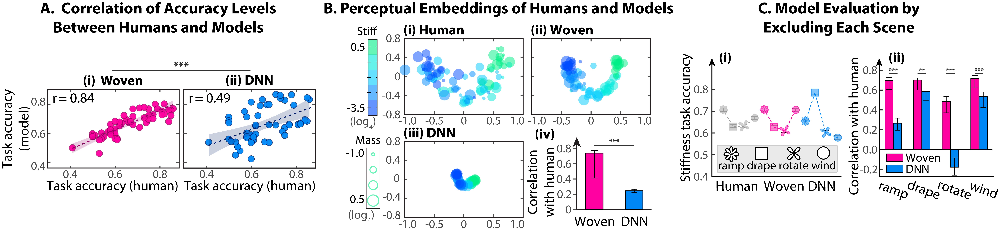
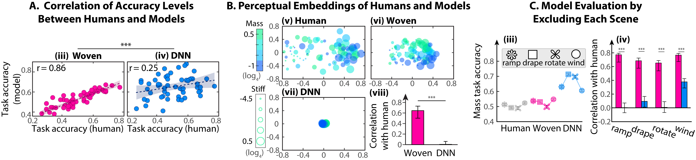
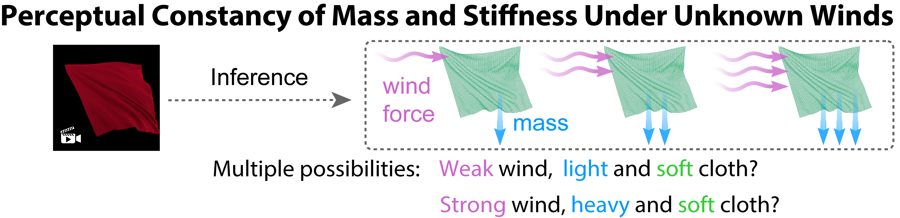
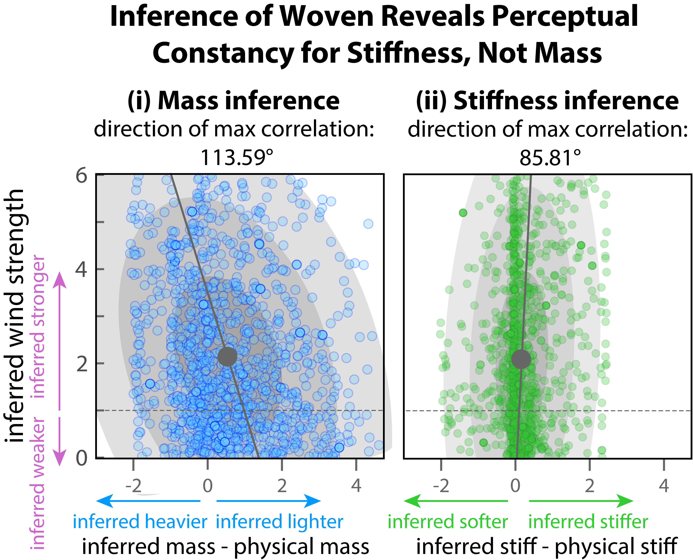

# Comparison of WOVEN and DNN performance
This repository includes comparisons of WOVEN and the DNN with human behavioral performance across three tasks: (1) stiffness estimation, where humans perform well; (2) mass estimation, where humans perform at chance; and (3) a novel prediction of the effect of wind on mass estimation, which is velidated by human behavioral results. The paper detailing these findings is currently under review. For a copy of the manuscript, please email me at [wenyan.bi@yale.edu].

## Evaluation 1: 2AFC stiffness matching task
### Task
On each trial, participants view a triad of cloth animations: a target cloth animation at the top center and two test videos at the bottom. The target video is referred to as the "target item," one of the bottom videos shares the same stiffness value as the target (the "match item"), and the other has a different stiffness value (the "distractor item"). The mass values for all three videos are randomly chosen from a predefined set of four possible values: [4-1, 4-0.5,40, 40.5]. 
Participants were instructed to choose the test videos that corresponded to the target cloth in terms of their stiffness values. 

    

### Results
#### When WOVEN and DNN models are calibrated to match the average accuracy of human participants, WOVEN explains a greater portion of the variance in human behavioral performance.

    
      

    

</strong>

## Evaluation 2: 2AFC mass matching task
### Task
The same procedure as the stiffness matching task, but participants were asked to match mass in this experiment.
### Results
#### WOVEN also generalizes better to explain human behavioral performance in a new task --- the mass matching task.

    
      

    

</strong>

## Evaluation 3: WOVEN predicts novel effects of mass on mass estimation.
Woven's joint inference of mass, stiffness, and wind strength predicts a differential effect of wind strength on physical properties. Specifically, it suggests that stiffness estimation is unaffected by wind strength, whereas mass estimation is influenced by it. When Woven infers stronger winds, it tends to perceive the cloth as lighter.

    
       

    

